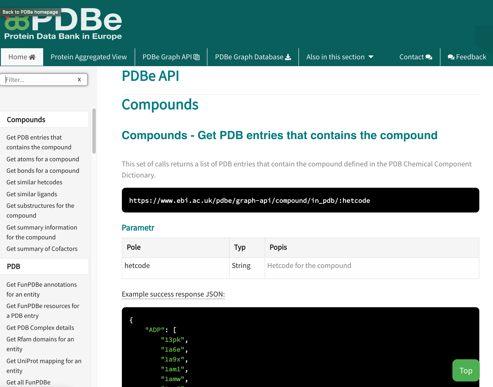
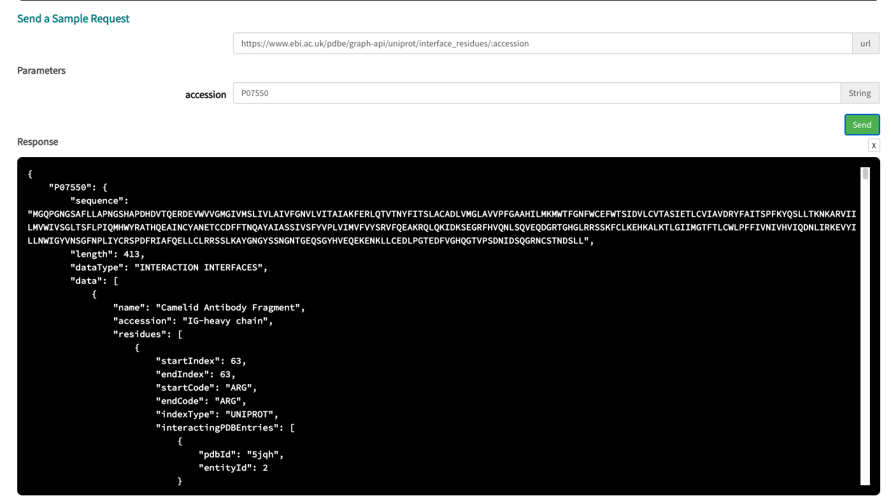

# Using the PDBe Graph API

Slides are available from <a href="../../_static/downloads/webinar4/2020_aggregated_api_webinar.pdf">here</a>.

## Introduction
PDBe Graph API (also referred as `Aggregated API`) is a RESTful API using PDBe Graph Database as backend. It currently supports only `GET` requests and provides aggregated data across all relevant PDB entries, for eg. based on entities, UniProt IDs, residues and more. 

API documentation can be accessed here [pdbe.org/graph-api](https://pdbe.org/graph-api)


### Using the documentation
The documentation is a web based application to work with the API. 



The application is mainly of two components,
* One the left side there is a list of API calls available which is categorised for easy navigation. Also it is equipped with a filter on top which helps in filtering the endpoints based on a keyword. 
* The right component provides a description of each call and the URL to be used to access it. It also provides information of the parameters to be used and description of fields in the result dataset in case of a successful response. 




There is also provision to try out the API from the documentation. This is available below the parameters section of each endpoint.

## Usecases

```eval_rst
.. toctree::
   :maxdepth: 0

   usecases/ligand_sites.ipynb
   usecases/accessible_residues.ipynb
```